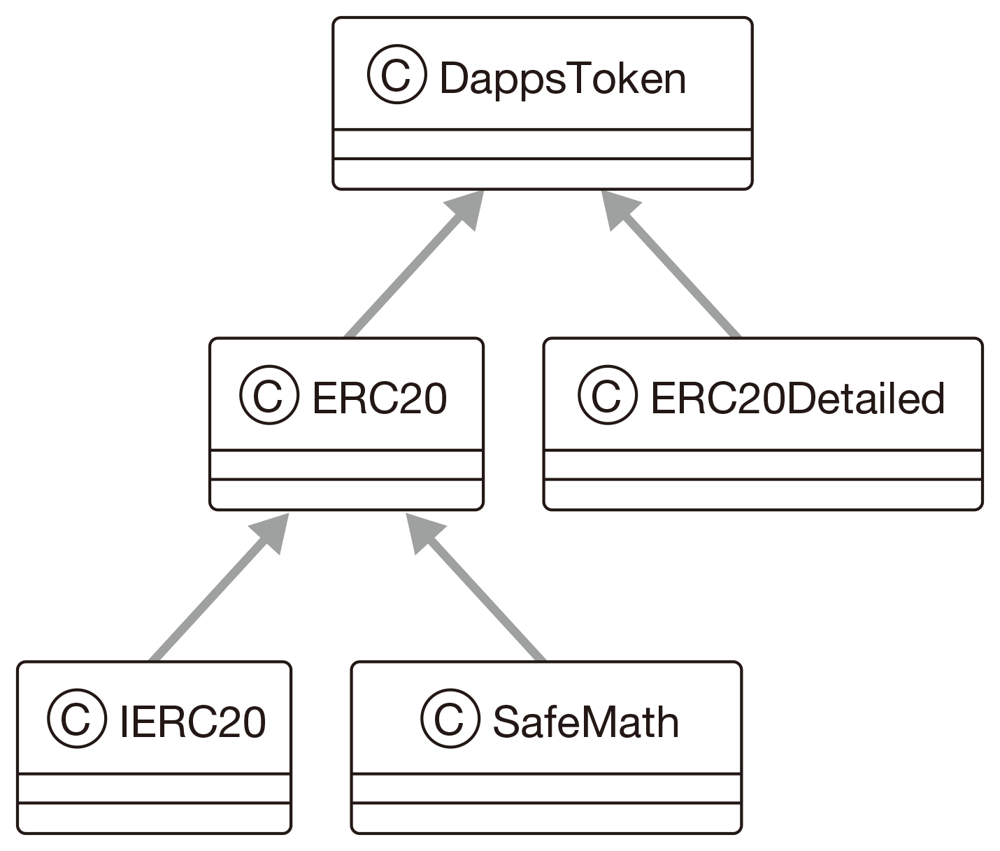

### 8.2.3 토큰의 스마트 계약 생성
토큰의 스마트 계약을 만들겠습니다. `[코드 8-7]`에서 소개하는 토큰의 스마트 계약을 단계별로 설명합니다.

**코드 8-7** 토큰의 스마트 계약(contracts/DappsToken.sol)

```solidity
pragma solidity ^0.4.24; // ①

// ②
import '../node_modules/openzeppelin-solidity/contracts/token/ERC20/ERC20.sol';
import '../node_modules/openzeppelin-solidity/contracts/token/ERC20/ERC20Detailed.sol';

contract DappsToken is ERC20, ERC20Detailed  { // ③
    uint public initialSupply = 1000;

    // ④
    constructor() ERC20Detailed("DappsToken", "DTKN", 18) public {
        _mint(msg.sender, initialSupply);
    }
}
````

❶ 솔리디티 버전을 확인합니다. 오픈제플린은 솔리디티 0.4.18 버전 이상에서 실행할 수 있습니다.  
➋ `import` 키워드로 오픈제플린의 `ERC20` 구현 클래스 ERC20.sol과 ERC20Detailed.sol을 불러옵니다.  
➌ `DappsToken` 계약은 `ERC20` 계약과 `ERC20Detailed` 계약을 상속합니다. `contract <계약 이름> is <상속하는 계약 이름>`으로 상속을 정의할 수 있습니다.

**그림 8-1** ERC20 토큰 클래스의 상속 관계



계약을 만들 때 호출하는 생성자를 정의합니다. `ERC20Detailed` 계약에 설정되어 있는 `name` 함수(토큰 이름), `symbol` 함수(토큰을 화폐 단위로 나타낼 때의 기호), `decimals` 함수(토큰에서 허용할 소수점 자릿수 설정)의 값(`"DappsToken", "DTKN", 18`)을 설정합니다. 그리고 현재 토큰을 발행한 계정 주소인 `msg.sender`에 `initialSupply` 변수에 저장한 토큰 발행 수를 할당하는 `_mint` 함수를 실행합니다. 참고로 `_mint` 함수는 `ERC20` 계약에 정의되어 있습니다.

참고로 이 절을 시작하면서 구현해야 하는 함수와 이벤트를 소개했습니다. 이는 오픈제플린에 있는 `ERC20` 계약을 상속하면 구현이 끝난 셈입니다.

다음으로 계약을 배포할 때 필요한 마이그레이션 스크립트를 작성해야 합니다. `[코드 8-8]`을 참고해 작성한 후 migrations 디렉터리에 저장합니다. 참고로 스크립트 파일 이름은 ‘숫자_작업 내용_계약 이름’으로 만드는 것이 일반적입니다.

**코드 8-8** 2_deploy_dapps_token.js

```javascript
var DappsToken = artifacts.require("./DappsToken.sol"); // ①

// ②
module.exports = function(deployer) {
    deployer.deploy(DappsToken);
}
```

❶ DappsToken.sol 파일을 호출해 실행 결과로 얻은 값을 `DappsToken` 변수에 할당합니다.  
➋ `deployer.deploy` 함수의 파라미터로 `DappsToken`을 설정해 배포합니다.