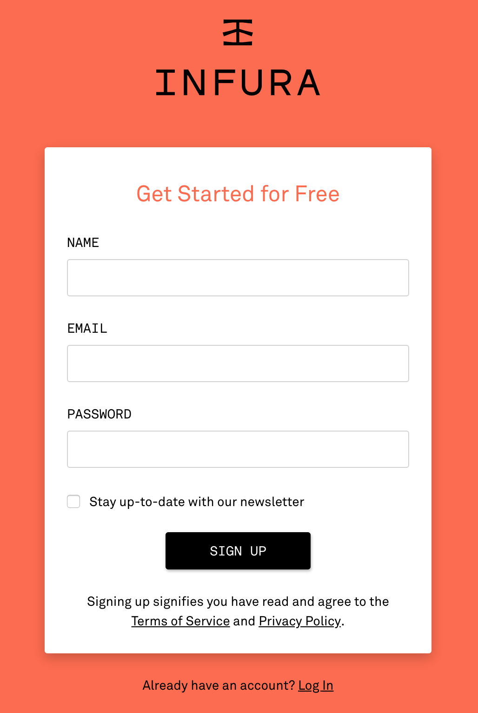
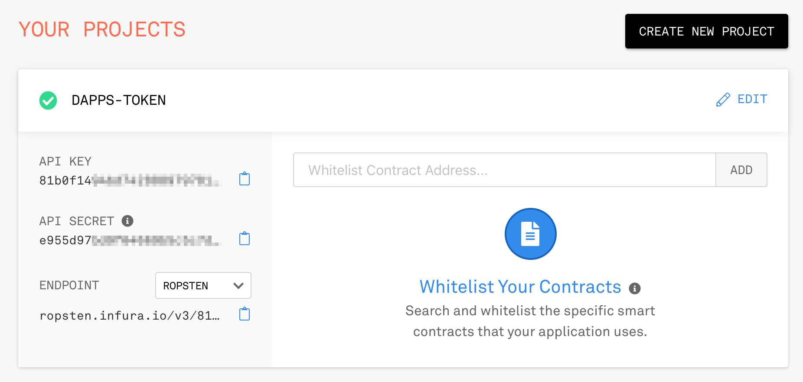

사용자 등록 화면 창이 열리면 회원 가입에 사용할 이름, 이메일 주소, 비밀번호를 입력하고 <SIGN UP>을 누릅니다.

**그림 8-11** Infura 등록 화면

회원 가입을 완료한 후 가입할 때 입력한 메일 주소로 등록이 완료되었다는 이메일을 받으면 인푸라 사용자 등록을 완료한 것입니다. 또한 로그인한 후 오른쪽 위 [≡] → [Documentation]을 선택하면 인푸라 사용에 도움을 주는 문서 페이지로 이동합니다. 왼쪽 위 [Choose a Network]를 누르면 각 테스트넷의 URL을 알려줍니다.

왼쪽 위 [DASHBOARD]를 선택하면 ‘YOUR PROJECTS’ 페이지로 이동합니다. 여기서 <CREATE NEW PROJECT>를 누른 후 ‘ADD NEW PROJECT’ 아래에 있는 [NAME] 항목에 새로운 이름(이 책에서는 dapps-token 프로젝트의 계약을 배포할 것이므로 dappstoken이라고 하겠습니다)을 입력한 후 <CREATE PROJECT>를 누르면 새 프로젝트가 만들어집니다. 프로젝트 생성 후 왼쪽의 [API KEY]는 [Choose a Network] 항목에서 소개한 테스트넷 URL의 your-api-key 부분에 적용할 키입니다. 오른쪽에 있는 클립보드 버튼을 누르면 복사할 수 있습니다. 다음 과정에 바로 사용할 것이니 잘 기억해두기 바랍니다.

**그림 8-12** API 키 발급

